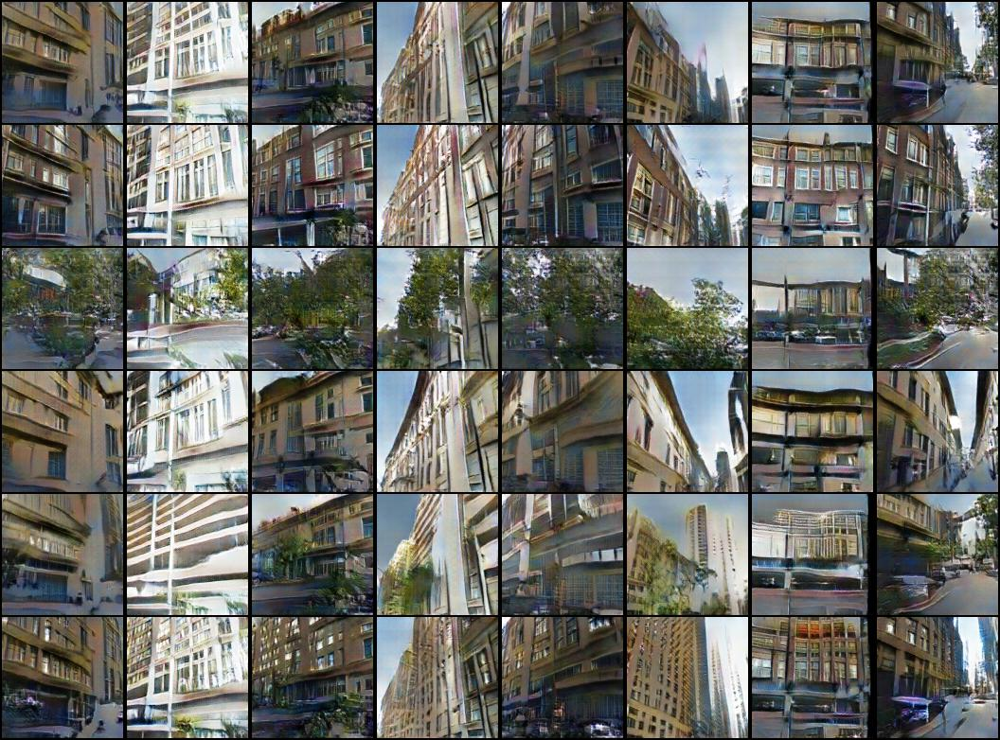

This is the code for the .

For training run 

    ./gan.py --dataset gan-city --dataroot dataset --batchSize 128 --imageSize 150 --cropSize 128 --hack
    
If you have a GPU, add the `--cuda` option for faster training.

You can inspect samples using `tensorboard`. The following is an example where the rows are: the average of all cities, Amsterdam, Washington D.C., Florence, Las Vegas and Manhattan. The columns are eight randomly chosen inputs to the generator. 

It is also possible to transition from cities. The following images has Amsterdam on the left side and Manhattan on the right one.

